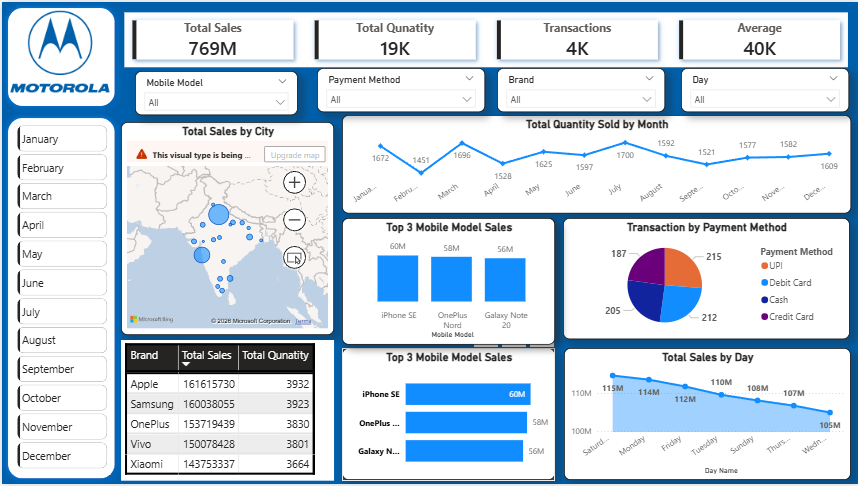

# 📊 Mobile Sales Dashboard using Power BI

## 🚀 Project Overview
Developed an interactive Power BI dashboard to analyze mobile sales performance, customer purchasing behavior, payment methods, and regional sales trends.

## 📌 Business Problem
Retail businesses generate huge mobile sales data but struggle to identify:
- Top-selling brands
- Customer purchasing trends
- Payment preferences
- City-wise sales performance

## 🎯 Objective
To build an interactive dashboard that helps stakeholders make data-driven decisions.

## 🛠 Tools & Technologies
- Power BI
- Power Query
- DAX
- Excel

## 📈 Dashboard KPIs
- Total Sales: ₹769M
- Total Quantity Sold: 19K
- Transactions: 4K
- Average Order Value: ₹40K

## 📊 Key Insights
- Apple and Samsung contributed highest revenue.
- UPI was the most preferred payment method.
- Weekend sales were higher than weekdays.
- Certain cities generated significantly higher revenue.

## 🧠 Skills Demonstrated
- Data Cleaning
- Data Modeling
- DAX Calculations
- Dashboard Design
- Business Intelligence Reporting

## Dashboard Preview

![Live] (Project.mp4)

